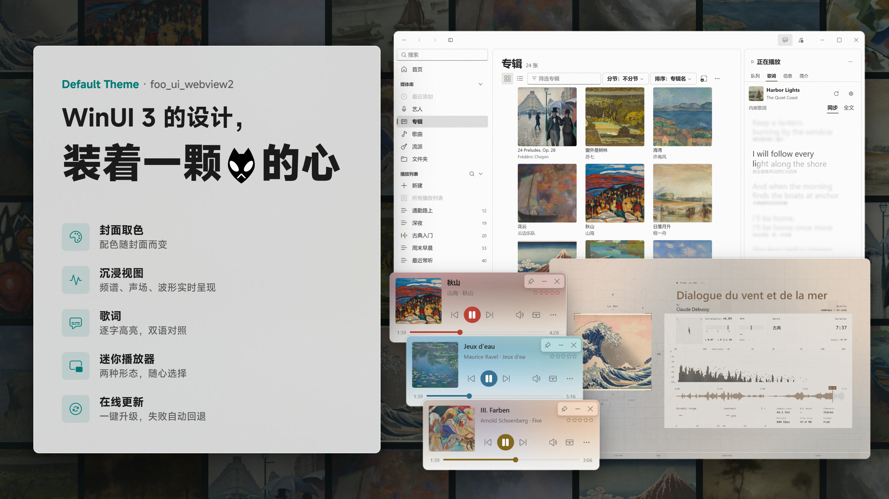

English | [中文](./README.zh-CN.md)

<p align="center">
  
</p>

# foo-webview-default-theme

[](LICENSE)
[](https://github.com/NereaFantasia/foo-webview-default-theme/releases)
[](https://github.com/NereaFantasia/foo_ui_webview2)

Default Theme is the default theme for [foo_ui_webview2](https://github.com/NereaFantasia/foo_ui_webview2). It gives foobar2000 a WinUI 3 style interface, built with React 19 and Fluent UI React v9, and reaches the player only through [foo-webview-sdk](https://www.npmjs.com/package/foo-webview-sdk).

- License: AGPL-3.0-only
- Interface languages: English, Simplified Chinese

---

## Features

- Cover colors — the palette follows the album art
- Immersive view — spectrum, stereo field and waveform in real time
- Lyrics — word-by-word highlighting, with translations
- Mini player — two layouts, your choice
- Online updates — one-click upgrades, automatic rollback on failure

---

## Installation

Requires foo_ui_webview2 2.0.0 or later, running as the standalone window (`Webview2 UI` as the default user interface). In DUI and CUI panels the theme only shows a notice that panels are not supported.

1. Download `foo-webview-default-theme-<version>.zip` from [Releases](https://github.com/NereaFantasia/foo-webview-default-theme/releases) or the [CNB mirror](https://cnb.cool/foo-ui-webview2/default-theme/-/releases).
2. Extract it to `<profile>\webview-ui\<template>\` so that `index.html` sits directly in that folder.
3. Select the template on the foo_ui_webview2 preferences page, then restart foobar2000.

See the [user guide](./GUIDE.md) for setup and everyday use.

> The [CNB repository](https://cnb.cool/foo-ui-webview2/default-theme) is for distribution only: it holds the release packages and the manifest that online updates read. It contains no source code; source, issues and pull requests are here on GitHub.

## Online updates

Choose an update mode under **Settings → About**. The default is **Check manually**.

| Mode | Behavior |
|----|------|
| Check manually | No automatic checks |
| Notify only | Notifies you when a new version is available; you decide whether to install it |
| Install automatically | Downloads and installs new versions in the background |

A new version takes effect the next time foobar2000 starts. Every download is checked against its signature and hash, and a version that fails to start three times in a row is rolled back to the previous one. The theme never restarts foobar2000 by itself and does not update the component or foobar2000.

If no version can start, click **Reset startup counts and retry** on the loading page. If that does not help, extract the full package into a new folder and select that folder in the preferences.

---

## Building from Source

> You only need this section to develop the theme itself. Users install the release package — see Installation above.

### Requirements

- Node.js 24, npm 11
- Microsoft Edge (browser tests)

### Commands

```powershell
npm ci
npm run dev        # Dev server on port 5190
npm run build      # Output in dist/
npm test           # Unit tests (Vitest)
npm run test:e2e   # Browser tests (Playwright)
```

To work against the live player, turn on **Use development server** on the Developer page of the foo_ui_webview2 preferences and enter `http://127.0.0.1:5190`.

`vendor/foo-webview-sdk.tgz` is a pre-release build of foo-webview-sdk; its version and checksum are recorded in `vendor/foo-webview-sdk.json`.

### Tech Stack

| Layer | Technology |
|----|------|
| UI | React 19, Fluent UI React v9 |
| State | Jotai |
| Build | Vite 8, TypeScript 5.9 |
| Lyrics | Apple Music-like Lyrics |
| Cover colors | Material Color Utilities |
| Host bridge | foo-webview-sdk (`vendor/`) |
| Tests | Vitest, Playwright |

### Project Structure

```
foo-webview-default-theme/
├── src/
│   ├── boot/               # Loading page: version selection, startup check, rollback
│   ├── app/                # Service wiring, page table, providers
│   ├── shell/              # Window shell: title bar, sidebar, player bar, right card
│   ├── library/            # Library places: home, albums, artists, genres, songs, folders, search
│   ├── playlist/           # Playlists
│   ├── immersive/          # Immersive view
│   ├── video/              # Video playback
│   ├── settings/           # Settings pages
│   ├── update/             # Online updater
│   ├── playback/ track/ table/ covers/ nav/ lyrics/   # Shared domain modules
│   └── host/ i18n/ theme/ motion/ styles/ kit/        # Foundation
├── public/                 # Static assets
├── tests/
│   ├── unit/               # Unit tests (Vitest), mirroring src/
│   ├── e2e/                # Browser tests (Playwright)
│   └── fixtures/           # Host test doubles
├── scripts/release/        # Release packages, manifests and signing
├── vendor/                 # foo-webview-sdk package
├── vite.config.ts          # App build
└── vite.boot.config.ts     # Loading page build
```

---

## License

This theme is licensed under the **GNU Affero General Public License v3.0 only** (AGPL-3.0-only); see [LICENSE](LICENSE) for the full terms.

Third-party code keeps its own license; see [THIRD_PARTY_NOTICES.md](THIRD_PARTY_NOTICES.md).

---

## Acknowledgements

- [foobar2000](https://www.foobar2000.org/)
- [foo_ui_webview2](https://github.com/NereaFantasia/foo_ui_webview2)
- [Fluent UI React](https://github.com/microsoft/fluentui)
- [Apple Music-like Lyrics](https://github.com/amll-dev/applemusic-like-lyrics)
- [Material Color Utilities](https://github.com/material-foundation/material-color-utilities)
- [OpenCC](https://github.com/BYVoid/OpenCC)
- [Lyricify Lyrics Helper](https://github.com/WXRIW/Lyricify-Lyrics-Helper)
- [foobox](https://github.com/dream7180) — the volume curve

The album art in the banner is public-domain (CC0) work from the Art Institute of Chicago. foobar2000 and its logo belong to their author.
